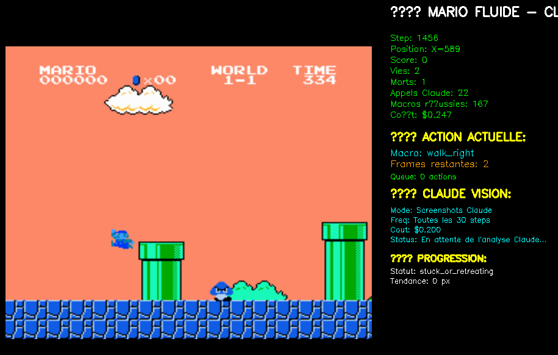
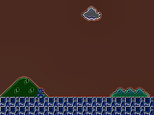

# Claude Mario Bros AI

A real-time AI agent that plays Super Mario Bros using Claude LLM for decision-making, featuring hybrid screenshot analysis and positional tracking for cost-optimized gameplay. Implements advanced learning systems, failure pattern detection, and priority-based survival strategies to help Mario complete levels intelligently.

## Overview

This project demonstrates how a large language model (Claude) can play Super Mario Bros in real-time by analyzing visual information and making strategic decisions. The system combines computer vision, AI decision-making, and game automation to create an intelligent Mario player.



The interface shows real-time statistics including Mario's position, current actions, API costs, and Claude's decision-making process. The AI prioritizes survival above all else, then systematically collects question mark blocks and progresses through the level.

## Key Features

- **Real-time LLM Integration**: Claude analyzes game state and makes decisions at 60 FPS
- **Hybrid Visual System**: Combines full screenshots with positional updates for cost optimization
- **Advanced Learning**: Records failure patterns and successful strategies to improve over time
- **Priority-based Decision Making**: Survival first, then strategic block collection and progression
- **Cost Optimization**: Reduces API costs by 90% while maintaining high update frequency
- **Threaded Architecture**: Non-blocking LLM calls ensure fluid gameplay

## Technical Architecture

### Hybrid Screenshot System

The system uses an innovative hybrid approach to balance cost and performance:



1. **Initial Context Establishment**: Full screenshot sent to Claude to understand the level layout, enemies, and obstacles
2. **Positional Updates**: Frequent lightweight updates (every 5 steps) containing only position changes of Mario and enemies
3. **Periodic Recalibration**: Full screenshots every 120 steps to maintain context accuracy
4. **Adaptive Switching**: Automatically switches to full screenshots when Mario appears stuck or in danger

### Decision Making Process

The AI follows a strict priority hierarchy:

1. **Survival (Maximum Priority)**: Avoid enemies, pits, and hazards
2. **Strategic Collection (High Priority)**: Hit question mark blocks to collect power-ups
3. **Progression (Medium Priority)**: Move forward when safe to do so

### Learning System

- **Action History**: Tracks last 50 actions with outcomes
- **Failure Pattern Detection**: Identifies locations and actions that lead to death
- **Strategy Recording**: Saves successful action sequences for similar situations
- **Death Analysis**: Records circumstances of each death for pattern recognition

## Installation

```bash
# Clone the repository
git clone https://github.com/yourusername/claude-mario-bros-ai.git
cd claude-mario-bros-ai

# Install dependencies
pip install gym-super-mario-bros
pip install nes-py
pip install opencv-python
pip install pillow
pip install anthropic
pip install numpy

# Set up Anthropic API key
export ANTHROPIC_API_KEY="your-api-key-here"
```

## Usage

```bash
python mario_fluid_llm.py
```

### Controls

- **ESC**: Quit the game
- **SPACE**: Pause/Resume gameplay

### Configuration

The system includes several configurable parameters:

- `positions_update_frequency`: How often to send positional updates (default: 5 steps)
- `context_recalibration_frequency`: How often to send full screenshots (default: 120 steps)
- `screenshot_cost_limit`: Maximum cost budget for screenshots (default: $1.00)
- `action_duration`: Duration of each macro action (default: 10 frames)

## How It Works

### Game State Analysis

The AI analyzes the game state through multiple channels:

1. **Visual Analysis**: Screenshots processed by Claude's vision capabilities
2. **Position Tracking**: Precise X/Y coordinates of Mario and all moving elements
3. **Game Info**: Lives, score, level progress from the game environment
4. **Historical Context**: Previous actions and their outcomes

### Action Selection

Claude receives structured information about the current situation and responds with JSON-formatted actions:

```json
{
  "actions": [
    {
      "macro_action": "jump_forward",
      "reasoning": "Enemy approaching, need to jump over it"
    }
  ],
  "strategy": "Avoiding Goomba while progressing",
  "urgency": 8
}
```

Available actions include:
- `walk_right`, `walk_left`: Basic movement
- `jump_forward`, `jump_backward`: Jumping with direction
- `run_right`, `run_left`: Faster movement
- `crouch`: Defensive position
- `jump_on_spot`: Vertical jump for blocks
- `wait`: Stop and assess

### Cost Optimization

The hybrid system dramatically reduces API costs:

- **Full Screenshot**: ~$0.01 per call
- **Positional Update**: ~$0.001 per call
- **90% Cost Reduction**: Compared to screenshot-only approach
- **3x Update Frequency**: More responsive than traditional methods

## Performance Metrics

The system tracks comprehensive statistics:

- API calls made and total cost
- Mario's death count and locations
- Successful strategies and failure patterns
- Level progression and score achievements

## Technical Requirements

- Python 3.7+
- Anthropic API key with Claude access
- OpenCV for display and image processing
- NES emulator environment (nes-py)
- Super Mario Bros ROM (legally obtained)

## Contributing

Contributions are welcome! Areas for improvement:

- Enhanced enemy prediction algorithms
- Advanced path planning for complex obstacles
- Multi-level learning and strategy transfer
- Performance optimizations for lower-end hardware

## License

This project is for educational and research purposes. Please ensure you have legal rights to use Super Mario Bros ROM files.

## Acknowledgments

- OpenAI Gym Super Mario Bros environment
- Anthropic's Claude AI for visual analysis and decision making
- NES-py emulator for game environment