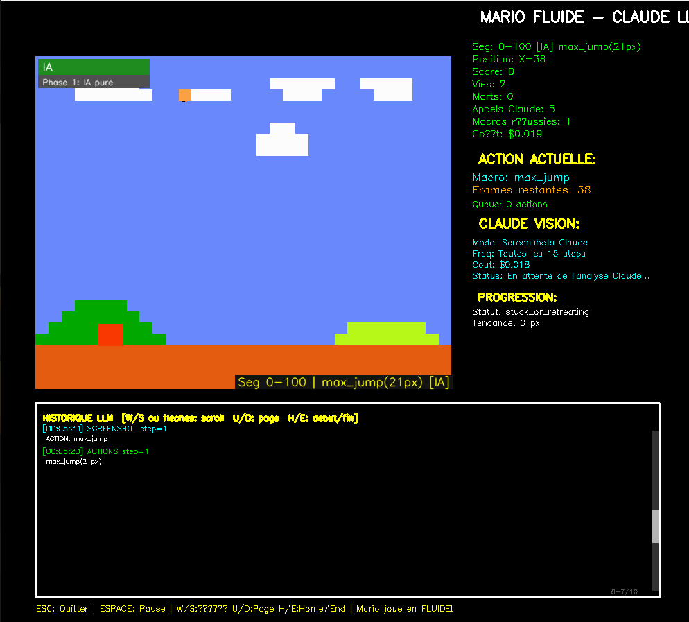
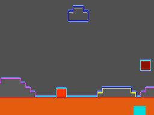
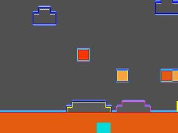
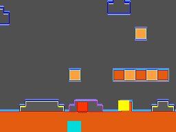

# Claude Mario Bros AI

A real-time AI agent that plays Super Mario Bros (NES) using Claude Haiku for decision-making. Claude analyzes screenshots of the game and decides which macro-actions to execute — no hard-coded rules, no pre-programmed reflexes.

## Overview



The interface shows real-time statistics: Mario's position, current macro action and remaining frames, action queue, API cost, and Claude's analysis status. The bottom panel displays the full LLM history (screenshots sent, actions decided). The right panel tracks progression tendency and detects stuck states.

Claude Haiku (3 and 4.5) can complete level 1-1. Each run is unique.

The cost of a full run is roughly 1 €, displayed live in the interface.

## How It Works





Screenshot of the game are captured, resized and optimized, then sent to Claude Haiku in real time. Claude analyzes the situation and responds with one or more macro-actions encoded as JSON. These macro-actions are translated into precise NES button inputs executed over several frames.

Claude's decisions are asynchronous: while Claude is analyzing a screenshot, the game keeps running and executes already-queued actions. In critical situations (imminent pit, nearby enemy), the game can briefly pause waiting for Claude's decision — preventing Mario from running into a hole while the model is thinking.

Claude receives no hard-coded rule such as "if enemy then jump". It simply observes the screen, reads the game context (position, score, detected obstacles) and makes a decision.

Claude has no access to the level map. At each new run, it discovers the environment from scratch. A memory system between runs allows it to learn from past mistakes: if an action caused Mario's death at a given obstacle, it can adapt its strategy in subsequent attempts.

### Macro-Actions

Instead of raw button presses, Claude picks from a set of macro-actions:

| Action | Description |
|--------|-------------|
| `run_forward px` | Run right for N pixels |
| `max_jump px` | Maximum jump (right+A+B), approach N pixels first |
| `pipe_jump px` | Two-phase jump to clear a standard pipe (approach + max jump) |
| `obstacle_jump px` | Jump for medium obstacles (20-40px high) |
| `high_obstacle_jump px` | Jump for tall obstacles (>40px) |
| `pipe_vertical_jump` | Vertical jump + right drift, for pipes Mario is pressed against |
| `run_jump_over px approach_px` | Run N pixels then jump — recommended for pits and enemies |
| `stomp_enemy px` | Approach and jump on an enemy |
| `step_back` | Move left to gain approach distance |

Claude responds with JSON:

```json
{"actions": [{"macro_action": "run_jump_over", "px": 80, "approach_px": 40}], "urgency": 8}
```

### Memory System

A segment memory records successful strategies and death locations across runs. Before each decision, Claude receives context about the current position: what worked before, where deaths occurred, which jumps succeeded.

### Multi-Phase Runs

- **Phase 1** (1st life): pure AI
- **Phase 2** (2nd life): 50% memory replay + AI
- **Phase 3** (3rd life): replay up to the furthest known point, then pure AI

### Rewind on Death

On death, the game restores the NES RAM state from a checkpoint taken 60 frames before the fatal action. Claude is then called synchronously to decide a corrective action before resuming.

## Installation

```bash
git clone https://github.com/ariden83/super-mario-bros-ia-player.git
cd super-mario-bros-ia-player

python -m venv .venv
source .venv/bin/activate
pip install -r requirements.txt

export ANTHROPIC_API_KEY="your-api-key-here"
```

## Usage

```bash
source .venv/bin/activate && python3 mario_fluid_llm.py
```

### Controls

- **ESC**: Quit
- **SPACE**: Pause / Resume
- **W/S or arrows**: Scroll LLM history
- **U/D**: Page up/down in history
- **H/E**: Jump to beginning/end of history

### Tunable Parameters

Stored in `mario_config_override.json`, adjusted automatically by the auto-improver:

| Parameter | Default | Description |
|-----------|---------|-------------|
| `stuck_check_frequency` | 60 | Steps between stuck detection checks |
| `positions_update_frequency` | 5 | Steps between position context updates |
| `known_solution_cooldown_px` | 40 | Min distance before replaying a known solution |
| `stuck_mode_max_tokens` | 200 | Max tokens for stuck-mode Claude calls |
| `reflex_cooldown_frames` | 80 | Cooldown between enemy reflex triggers |
| `hole_reflex_cooldown_frames` | 15 | Cooldown between hole reflex triggers |

## Key Files

| File | Role |
|------|------|
| `mario_fluid_llm.py` | Main game loop + LLM integration (~3900 lines) |
| `mario_segment_memory.py` | Per-segment strategy memory |
| `mario_auto_improver.py` | Meta-learning loop (analyzes logs, patches code) |
| `mario_config_override.json` | Auto-adjusted parameters |
| `logs/` | Session logs (actions, Claude responses, summary) |
| `backups/` | Timestamped backups before each auto-improver patch |

## Technical Requirements

- Python 3.10+
- Anthropic API key (Claude Haiku access)
- See `requirements.txt` for full dependency list

## License

This project is for educational and research purposes.

## Acknowledgments

- [gym-super-mario-bros](https://github.com/Kautenja/gym-super-mario-bros) for the NES environment
- [Anthropic](https://www.anthropic.com) — Claude Haiku for vision and decision-making
